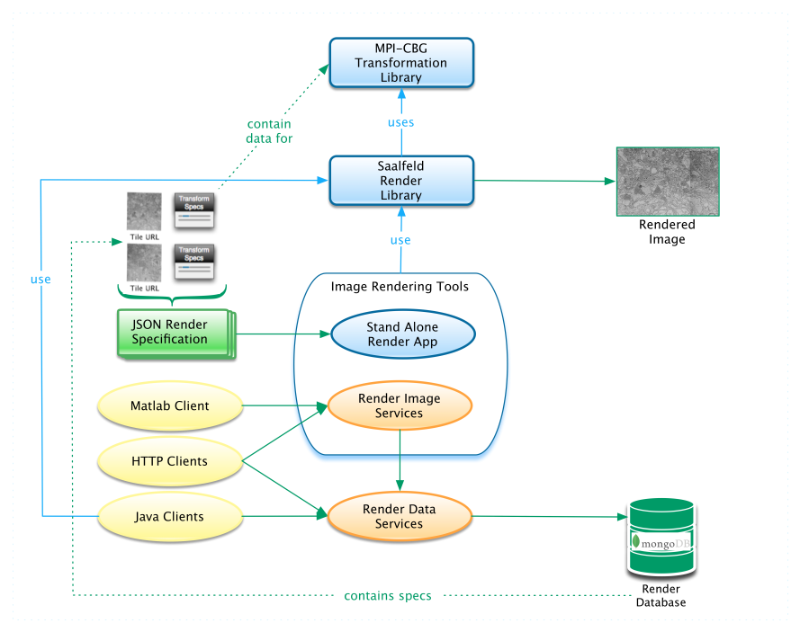

# Render Tools and Services

A collection of Java tools and HTTP services (APIs) for rendering transformed image tiles that includes:

  - a JSON [data model] for render, tile, and transform specifications,
  - a Java stand-alone [render application] / library,
  - a set of [render web services] that provide [RESTful APIs] to 
    persisted collections of tile and transform specifications, and 
  - a set of [Java clients] for processing/rendering data that utilize the [render web services] 
    to retrieve and/or store persisted specifications.
  - [Docker packaging] for building the libraries and deploying the [render web services]  
  
  
  
  [data model]: <docs/src/site/markdown/data-model.md>
  [Java clients]: <docs/src/site/markdown/render-ws-java-client.md>
  [level 2 REST]: <http://martinfowler.com/articles/richardsonMaturityModel.html>
  [render application]: <docs/src/site/markdown/render-app.md>
  [render web services]: <docs/src/site/markdown/render-ws.md>
  [RESTful APIs]: <docs/src/site/markdown/render-ws-api/render-ws-api.md>
  [Docker packaging]: <docs/src/site/markdown/render-ws-docker.md>