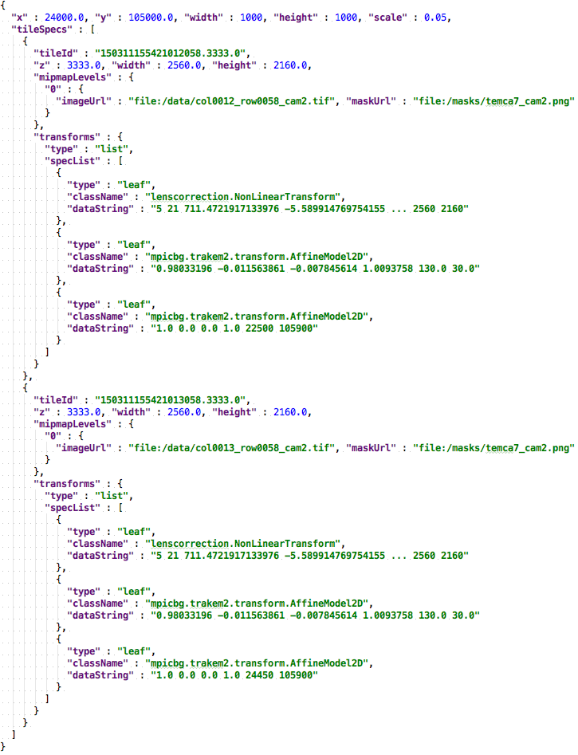
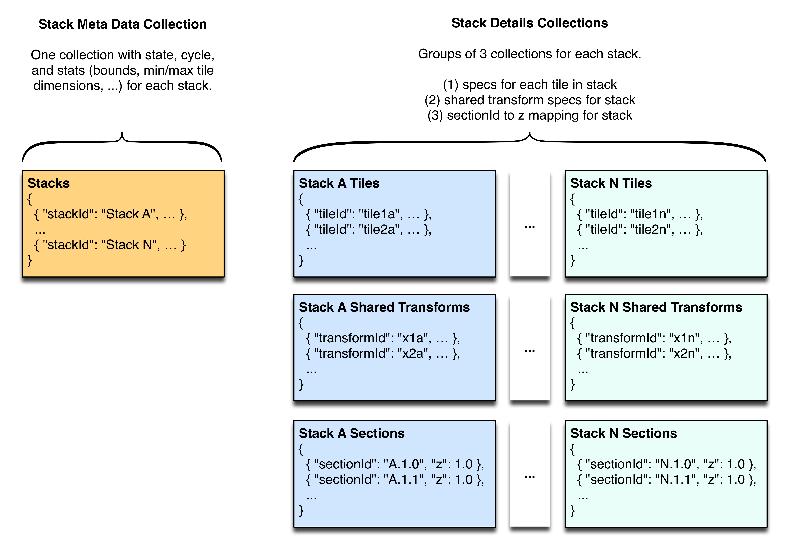

# Render Data Model

Rendering is driven by a JSON [render parameters specification] that contains one or more [tile specification] 
elements that describe the source images and transformations for the canvas to be rendered.
Each [tile specification] element contains location information for a source image and (optionally) its mask 
along with zero or more [transform specification] elements that describe how the source image should be
transformed.

Here is an example of a simple [render parameters specification]:

# Render Database

The render database is a [MongoDB] document store that supports large scale persistence of [tile specification] and 
shared [transform specification] data.
Access to the document store is managed through the [render web services].
Stored specification collections are grouped by stack as follows:

To reduce the storage footprint, we've introduced an unorthodox relational element to the document data structure.
All shared [transform specification] documents (e.g. lens correction transforms) are stored in a separate collection
and can be referenced by id from individual [tile specification] documents.
The [render web services] handle resolution of the references before returning specifications to clients.

Here is an example of how the relationships are used:

  [MongoDB]: <https://www.mongodb.org/>
  [render parameters specification]: <../../../../render-app/src/main/other/renderRequest.schema.json>
  [render web services]: <render-ws.md>
  [tile specification]: <../../../../render-app/src/main/other/tilespec.schema.json>
  [transform specification]: <../../../../render-app/src/main/other/transformSpec.schema.json>
