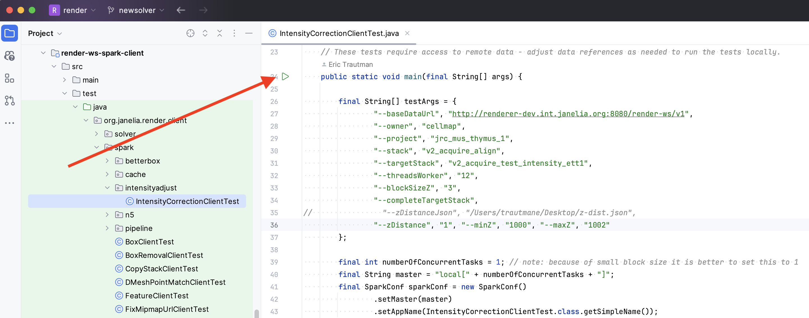
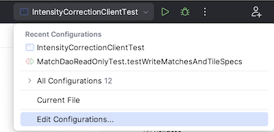
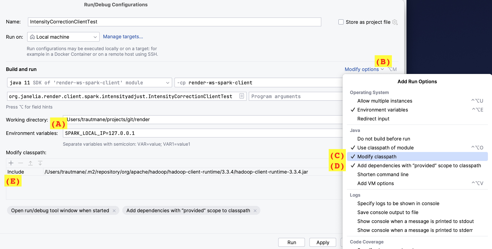

# How To: Run Spark Locally in IntelliJ

It can be useful to run and test render spark clients within an IDE  
[using a local master URL](https://spark.apache.org/docs/3.4.1/submitting-applications.html#master-urls).  Unfortunately 
because we need to exclude spark libraries from the render-ws-spark-client fat jar, you'll need to add a 
few extra settings to your IntelliJ run configuration to get spark clients to run within the IDE.

## 1. Install Hadoop Client Runtime

The hadoop client runtime library is required to run spark locally.  If you don't already have it in a local directory, 
an easy way to install it is to: 
- Comment out the library's exclusion block in the 
[render-ws-spark-client pom.xml](../../../../../render-ws-spark-client/pom.xml#L213-L216):
```
<!--
  <exclusion>
    <groupId>org.apache.hadoop</groupId>
    <artifactId>hadoop-client-runtime</artifactId>
  </exclusion>
-->
```
- Run `mvn compile` to pull the library into your local .m2/repository.  The compilation will fail because of 
  the enforcer no-duplicate-classes rule, but the jar will get pulled.
- Once `${HOME}/.m2/repository/org/apache/hadoop/hadoop-client-runtime/3.3.4/hadoop-client-runtime-3.3.4.jar` exists,
restore the pom.xml file to its original state by uncommenting the exclusion.

The local hadoop-client-runtime-3.3.4.jar path can then be referenced in all IntelliJ run configurations 
that use spark.  This means you'll only need to do this install process once unless you change spark versions 
or clean out your local `${HOME}/.m2/repository`.  

## 2. Create IntelliJ Run Configuration

Find the spark client you want to run in IntelliJ click the run button next to the main method.



The run will fail with an exception but the base run configuration will be created.  

## 3. Edit IntelliJ Run Configuration

Select the run drop-down menu and click Edit Configurations...



Then make the following changes to the run configuration (and save the changes):
- A: Add `SPARK_LOCAL_IP=127.0.0.1` to the environment variables so that runs will work when you are connected via VPN. 
- B: Select the `Modify options` drop-down menu.
- C: Select `Modify classpath`. 
- D: Select `Add dependencies with "provided" scope to classpath` and close the drop-down menu.
- E: Click the `+` button below `Modify classpath:` and use the dialog to add the hadoop-client-runtime-3.3.4.jar 
     path from your local .m2/repository.  This can be a little tricky on Macs because the .m2 directory is usually 
     hidden from Finder windows.  On Macs you can use `⌘⇧.` to reveal dot files or use `⌘⇧G` to open a 
     Go dialog and paste in a path. 




  
